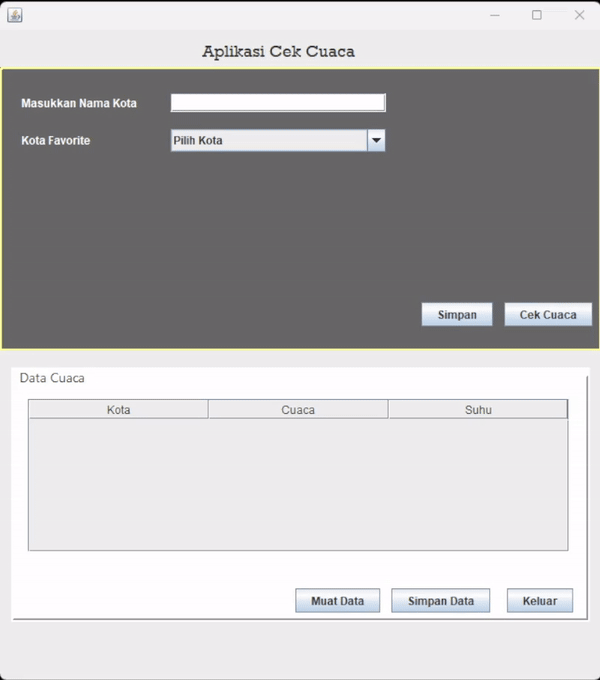

# Aplikasi Cek Cuaca

Aplikasi ini adalah proyek berbasis Java Swing yang memanfaatkan API OpenWeatherMap untuk menampilkan informasi cuaca terkini dari berbagai kota. Anda juga dapat menambahkan kota favorit, melihat data cuaca dalam tabel, dan menyimpannya ke dalam file CSV.

## Fitur

- **Cek Cuaca**: Masukkan nama kota untuk melihat kondisi cuaca terkini, suhu, dan informasi terkait.
- **Kota Favorit**: Tambahkan kota favorit Anda ke daftar untuk memudahkan pemilihan.
- **Tabel Data Cuaca**: Tampilkan data cuaca dari kota favorit dalam tabel yang dapat diekspor ke file CSV.
- **Impor dan Ekspor**: Simpan data cuaca ke dalam file CSV dan muat data saat diperlukan.
- **Integrasi OpenWeatherMap API**: Mendapatkan data cuaca secara real-time.

## Prasyarat

Sebelum menjalankan aplikasi, pastikan Anda memiliki:

- **Java Development Kit (JDK)** versi 8 atau lebih baru
- **Internet** untuk mengakses API OpenWeatherMap
- **API Key** dari [OpenWeatherMap](https://openweathermap.org/api). Ganti `apiKey` di dalam kode dengan API key Anda sendiri.

## Penggunaan

1. **Masukkan nama kota** di kolom input dan klik tombol `Cek Cuaca` untuk mendapatkan informasi cuaca.
2. **Tambahkan kota** ke daftar favorit dengan mengklik tombol `Simpan`.
3. **Pilih kota favorit** dari `ComboBox` untuk memuat data cuaca.
4. **Simpan data cuaca** ke file CSV dengan mengklik tombol `Simpan Data`.
5. **Muat data dari CSV** dengan mengklik tombol `Muat Data`.

## Struktur Proyek

- **CekCuacaFrame.java**: File utama yang mengatur antarmuka pengguna dan logika aplikasi.
- **data_cuaca.csv**: File tempat data cuaca akan disimpan.

## API

Aplikasi ini menggunakan API OpenWeatherMap. Untuk menggunakan API, buat akun dan dapatkan API key dari [OpenWeatherMap](https://openweathermap.org/api).

## Catatan

- Pastikan koneksi internet Anda stabil saat menjalankan aplikasi, karena aplikasi memerlukan akses ke API cuaca.
- Jangan lupa mengganti `apiKey` dengan API key Anda sendiri.

## DEMO

# Pembuat Aplikasi
 Muhammad Akmal ( 2210010437 )
